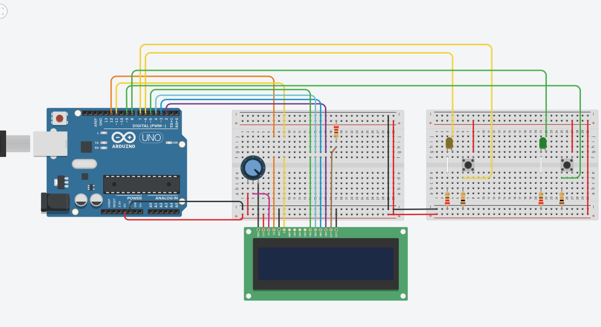

# ReactionWar1v1
ReactionWar is a school project created with Arduino in c, where you have to gain more points than your opponent, first player to 100,000 points wins.

## Rules: 
  * When your LED lights up click the button as fast as you can
  * You can see who wins/your score on the LCD display
  * Player choice is random
## Assignment of points:
  * If your reaction time is greater than 500ms: 5000 points
  * If your reaction time is between 500ms and 200ms: 8000 points
  * If your reaction time is less than 200ms: 10000 points
## Connecting the display and buttons/leds to arduino

## Components: 
 * a bunch of Arduino cables
 * 5 Resistors(3 x 220ohm, 2 x 10k ohm)
 * Potentiometer 250k ohm
 * 2 Button
 * 2 Led
 * 1 LCD display
 * 1 Arduino
